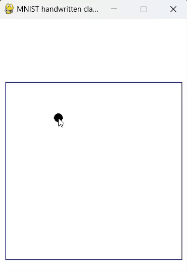

# MNIST-classification

Train a simple CNN for handwritten digit classification.

## Prerequisites

1. Clone this repository.
2. Install the dependencies.

    ```bash
    pip install -r requirements.txt
    ```

## Training

See [MNIST_handwritten_digit_classification.ipynb](MNIST_handwritten_digit_classification.ipynb)

## Testing

- To open a whiteboard, run:
    
    ```bash
    python main.py
    ```
- Draw using your mouse, press `DEL` to clean the board.

<p align="center">
  
</p>